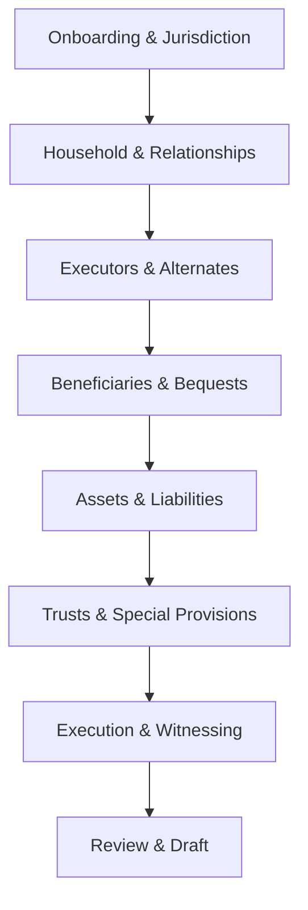

# Willit Backend & Prompt Design

Purpose: A nimble, agentic backend that guides a user through will creation, with strong emphasis on gathering complete, jurisdiction-aware information prior to drafting. This document defines business logic, prompt structure, module layout, and contracts, following the functional style used in learned-hand-ai/platform/server/src/analyze (top-level module functions, async, structured prompts, acceptance criteria, minimal class usage). We explicitly avoid heavy typing frameworks (no Pydantic models) to stay fast and flexible.

## Conventions
- Functional modules; avoid heavy classes. Keep orchestration in `processing.py`; prompt-building in `prompts.py`.
- No Pydantic or rigid typing. Use plain dict/list JSON contracts and lightweight runtime validators where needed.
- Enums: prefer plain strings; only introduce enums when absolutely necessary (e.g., safety‑critical state machines, external API/DB interop, or contract enforcement). Keep enums minimal, versioned, and map to stable string values in I/O.
- Prompt drivers isolate LLM/vision/ASR/TTS vendor specifics in `prompt_drivers.py`.
- Outputs must be machine-parseable with explicit delimiters. Prefer JSON in fenced blocks: ```json ... ``` or sentinel wrappers ~~| ... |~~ where appropriate.
- Follow learned-hand analyze patterns:
  - Module-level async functions with descriptive names (e.g., `find_issues`, `rule_statements_from_briefs`).
  - Message histories shaped as `{role, content:[{type, text}]}` blocks.
  - Decorate key prompts/orchestrations with observability wrappers when available; otherwise keep function boundaries clean for easy instrumentation.
- Idempotent processing functions; deterministic side-effects isolated in `processing.py`.

## Directory Layout (backend)
- `backend/willit/`
  - `router.py` – FastAPI (or Starlette) routes and contracts (HTTP + WS/SSE for chat/voice and uploads/exports). Accept raw JSON dicts.
  - `processing.py` – Orchestration of flows, state updates, storage, tool calls.
  - `prompts.py` – All prompt builders and prompt-facing functions (LLM calls via drivers).
  - `prompt_drivers.py` – `ask_llm_*` wrappers (text, vision, tool-use), TTS/ASR adaptors.
  - `preprocessing.py` – File/image pipeline: MIME detect, OCR, layout parsing, embeddings.
  - `content_extraction.py` – HTML/JSON content extraction and cleaning (match analyze style).
  - `will_logic_flow.py` – Mermaid diagrams + string constants for guided-question flow.
  - `contracts.py` – Optional JSON Schema snippets and runtime validators (no Pydantic).

Note: We keep classes minimal; no Pydantic models. `contracts.py` only contains shape examples and tiny runtime validators for critical paths.

## Core Data Shapes (informal)
- `Session` (dict): `{ id, user_id, jurisdiction, status, created_at }`
- `Message` (dict): `{ role: "user|assistant|tool", text, attachments?, tool_calls?, created_at }`
- `WillProfile` (dict): normalized facts (testator, spouse/partner, dependents, executors/alternates, guardians), contact info, witness prefs, healthcare/POA options.
- `Assets` (dict): financial accounts, real property, vehicles, digital assets, pets; specific bequests; residuary.
- `Instructions` (dict): debts/taxes, funeral/burial/cremation, charitable gifts, trusts.
- `Uploads` (dict): `{ id, filename, mime, pages_text[], embeddings?, session_id, message_id }`
- `Draft` (dict): `clauses[]`, `outline[]`, `versions[]`, `validations[]`, `exports[]`.
- `Gaps` (list of dict): `{ id, description, severity: "BLOCKING|ADVISORY", suggestions[] }`
  - If an enum is required for `severity` or similar: define the smallest necessary set, store/transport as strings, and validate at boundaries.

## Business Logic Phases
1) Onboarding & Jurisdiction
   - Determine jurisdiction (country/state/province) and legal requirements (witness count, notarization, self-proving affidavits).
   - Validate eligibility (age, sound mind).
2) Household & Relationships
   - Testator identity; spouse/partner; prior marriages; dependents/minors; guardians.
3) Executors & Alternates
   - Primary and alternates; compensation; bond requirements.
4) Beneficiaries & Bequests
   - Specific gifts (including uploaded items/images); residuary distribution; per stirpes vs per capita.
5) Assets & Liabilities
   - Property classification; non-probate assets; debts and taxes preferences.
6) Trusts & Special Provisions
   - Minor’s trusts; special needs; pet trust; digital assets; business interests.
7) Execution & Witnessing
   - Jurisdiction-specific signing instructions; self-proving affidavits; notary.
8) Review & Draft
   - Compile clauses, validate, highlight gaps and conflicts; export to DOCX/PDF.

Each phase exposes slot-fill questions; all missing, ambiguous, or conflicting slots are tracked in `Gaps` and drive the next question selection.

## Module Responsibilities & Contracts

### router.py
Defines the HTTP and streaming surface. Mirrors analyze `router.py` conventions but uses plain dicts.

- HTTP
  - `POST /sessions` → create session; returns a JSON dict.
  - `GET /sessions/{id}` → session state snapshot (profile, gaps, draft status).
  - `POST /sessions/{id}/messages` → append user message; triggers `processing.handle_message`.
  - `POST /uploads` (multipart) → preprocess; returns `Upload` and summary.
  - `POST /drafts/{id}/export?format=docx|pdf` → stream file.
  - `GET /health` → liveness/readiness.
- WebSocket or SSE
  - `/chat/stream?session_id=...` events: `assistant_delta`, `tool_call`, `tool_result`, `state_update`, `gap_update`, `voice.start|chunk|stop`, `tts.chunk|end`.
- No Pydantic models. Endpoints accept/return JSON dicts; minimal runtime validators check required keys where necessary.

### processing.py (orchestrator)
Single-responsibility async functions that coordinate prompts, state mutations, and tools.

- `handle_message(session_id, message)`
  - Steps:
    1. Normalize input; if attachments present → `preprocessing.preprocess_uploads`.
    2. Run `prompts.extract_facts_from_text` and `prompts.summarize_upload` (if any).
    3. Merge FactDiff into `WillProfile`; recompute `Gaps` via `prompts.list_gaps`.
    4. If gaps remain, call `prompts.propose_next_questions` → stream questions.
    5. When minimally complete, call `prompts.generate_draft_outline` then `prompts.suggest_clause` per section.
    6. Run `prompts.validate_jurisdiction` and `prompts.validate_execution_requirements`.
    7. Persist `Draft` version and emit events.
- `apply_fact_diff(profile, diff)` → canonical merge with provenance.
- `ingest_voice_chunk(session_id, audio_bytes)` → push to ASR driver; update interim transcript message.
- `synthesize_tts(session_id, text)` → TTS driver; emit audio chunks.

### prompts.py (prompt interfaces)
Functional, message-history-based prompt functions. Do not own state; accept plain dict/string inputs and return parseable outputs. Build prompts with clear goals + acceptance criteria. Output contracts are stable and versioned via simple `version` fields.

- `extract_facts_from_text(text: str, jurisdiction: str, known_facts: dict) -> FactDiffJSON`
  - Parses free-form user text to normalized facts. Returns JSON in ```json fences with keys: `add`, `update`, `remove`, and `rationale`.
- `summarize_upload(upload_text: str, mime: str, jurisdiction: str) -> UploadSummaryJSON`
  - From OCR’d text or parsed content, extract possible bequests, identities, addresses, account metadata.
- `list_gaps(profile: dict, jurisdiction: str) -> GapListJSON`
  - Compute missing/ambiguous fields with severity and suggested questions.
- `propose_next_questions(profile: dict, gaps: list, k: int=3) -> QuestionsJSON`
  - Choose next best questions, prioritizing `BLOCKING` gaps; include tool suggestions (e.g., request image of item).
- `suggest_clause(clause_type: str, facts: dict, jurisdiction: str) -> ClauseJSON`
  - Deterministically structured clause payload with `title`, `body`, `citations` (if any), and `assumptions`.
- `generate_draft_outline(profile: dict, jurisdiction: str) -> OutlineJSON`
  - Section ordering and presence (e.g., guardianship only if minors present).
- `validate_jurisdiction(profile: dict, draft: dict, jurisdiction: str) -> ValidationJSON`
  - Checks: witness count, notarization, self-proving affidavits, disinheritance constraints.
- `validate_execution_requirements(jurisdiction: str) -> ExecutionChecklistJSON`
  - Human-facing checklist for signing.

Each function builds `message_history = [{role, content:[{type, text}]}]` and calls `prompt_drivers.ask_llm_*`. Acceptance criteria must specify exact output format and delimiters to ensure reliable parsing (see “Output Formatting”).

### prompt_drivers.py
Abstract all model and tool specifics. Mirror analyze `ask_gpt_*` style.

- `ask_llm_text(input_prompt, model_name, effort, verbosity)` → returns `{ output_text, raw, choices? }`.
- `ask_llm_vision(input_prompt, image_urls|data, model_name)` → OCR/vision fusion for images.
- `ask_llm_structured(input_prompt, schema_json)` → enforce JSON structure with retries.
- `ask_llm_websearch(...)` (optional; not a priority for will drafting).
- `ask_asr(audio_bytes, language)` → returns interim/final transcript.
- `synthesize_tts(text, voice)` → returns stream/chunks.

Drivers handle:
- Token budgeting and truncation.
- Retry with backoff; temperature/effort knobs; latency trade-offs.
- Normalizing outputs (always expose `.output_text`).

### preprocessing.py
Stateless pipeline entrypoints; orchestrated by `processing.py`.

- `preprocess_uploads(files)`
  - MIME detect → page split → OCR (for images/PDF scans) → layout parse → `content_extraction.extract_content` → embeddings (optional) → return `PreprocessResult` with text, per-page metadata, thumbnails.
- `preprocess_image(image_bytes)`
  - Denoise/deskew → OCR → object detection (document vs. item photo) → return text + tags.
- Apply basic safety: size limits, allowlist of MIME types.

### content_extraction.py
Match analyze implementation: remove anchors and validation spans, strip remaining tags; handle nested JSON content lists. Keep pure function.

### will_logic_flow.py
Define the guided flow as constants (for docs and UI alignment). Example mermaid diagram constant:



Also export enum-like strings for section keys (e.g., `JURISDICTION`, `RELATIONSHIPS`, `EXECUTORS`, `BENEFICIARIES`, `ASSETS`, `TRUSTS`, `EXECUTION`, `REVIEW`).

## Prompt Patterns & Output Formatting
Follow analyze-style message history and explicit acceptance criteria:

- Use developer/system roles to hold task/acceptance rules; user role to inject facts.
- Require outputs inside one of:
  - Triple-backticked JSON block: start with ```json and end with ```
  - Sentinel wrappers: `~~|` and `|~~` for lists where simpler parsing is desired.
- Include `version` and `schema` keys to allow future migrations.

Example: `propose_next_questions`

System/developer content:
```
You are a will-prep assistant. Task: propose the next 1–3 questions to resolve BLOCKING gaps first, then ADVISORY. Acceptance criteria:
- Output JSON in ```json fences with keys: version, questions[], each with id, text, rationale, gap_ids[], expected_type, optional_tool_request.
- If no gaps remain, set questions=[] and include {"status":"READY_TO_DRAFT"}.
```

User content:
```
jurisdiction: "CA"
known_facts: {...}
gaps: [{"id":"guardianship_missing","severity":"BLOCKING",...}]
```

Expected model output:
```json
{
  "version": "1.0",
  "status": "ASKING",
  "questions": [
    {
      "id": "guardian_primary",
      "text": "Who should be the primary guardian for your minor child(ren)?",
      "rationale": "Minors present; guardianship is required in CA",
      "gap_ids": ["guardianship_missing"],
      "expected_type": "person_selector",
      "optional_tool_request": null
    }
  ]
}
```

## Validation & Determinism
- Each prompt includes an “Acceptance” block that restates output shape and any domain constraints (e.g., witness requirement ranges).
- Parsing layer rejects malformed outputs; drivers retry with a reduced prompt or schema-based generation.
- All clause generation should note assumptions explicitly; `processing.py` escalates any assumption to a new gap/question.

## Events & Streaming
- Chat events:
  - `assistant_delta` – token/segment stream of assistant content.
  - `tool_call`/`tool_result` – OCR, ASR, validations.
  - `gap_update` – additions/resolutions of gaps.
  - `state_update` – profile/draft updates and version ids.
- Voice events:
  - `voice.start|chunk|stop` from client mic to ASR.
  - `tts.chunk|end` for audio playback.

## Storage & State
- DB tables: sessions, messages, profiles, uploads, drafts, gaps. Start with SQLite in dev; Postgres + pgvector in prod/dev with Docker.
- Object storage: MinIO for file bytes; DB only stores metadata and signed URLs.
- Versioned drafts; each export links back to the draft version and profile snapshot.

## Testing
- Unit tests for `content_extraction.py`, prompt parsers, and `processing.apply_fact_diff`.
- Contract tests for `router.py` endpoints and WebSocket events.
- Golden tests for prompts: fixture inputs → expected JSON outputs (shape validation only, no Pydantic).

## Security & Privacy
- Restrict MIME types; size/time limits; virus-scan hook (optional).
- Encrypt PII at rest; signed URLs for object storage; short-lived WS tokens.
- Data retention: session-level retention policy; anonymize/redact in logs.

## Implementation Notes
- Code style and names mirror analyze: module-level async functions, `ask_llm_*` in drivers, explicit prompt contracts, deterministic return shapes.
- Keep modules small and composable; `processing.py` is the sole owner of side-effects and persistence.
- Start simple (no external search). Add ASR/TTS behind driver interfaces; front-end can use browser Speech APIs initially.
